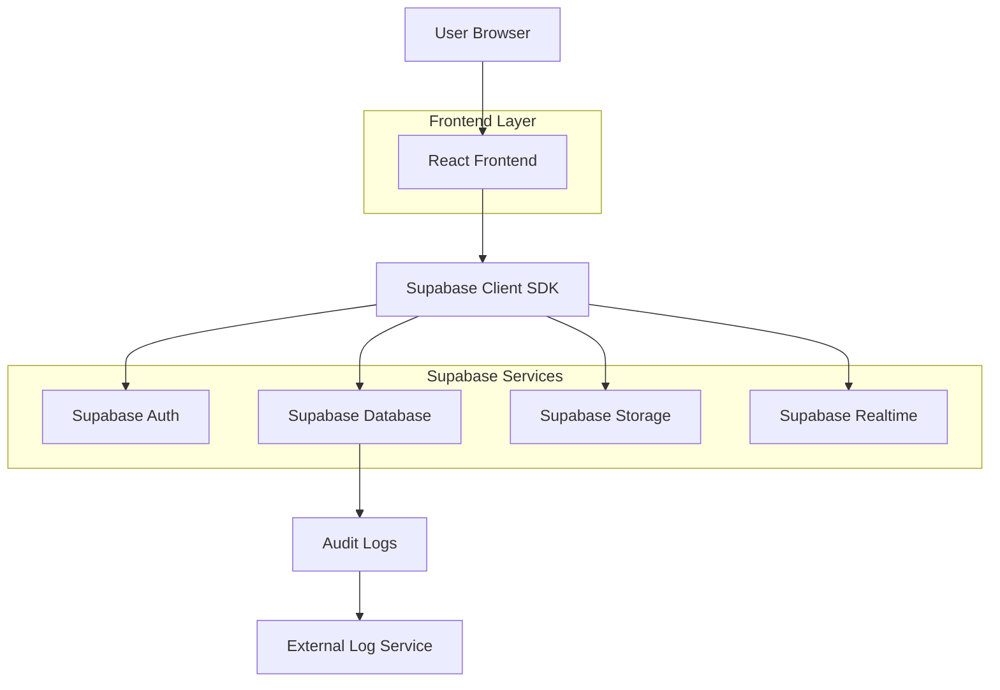
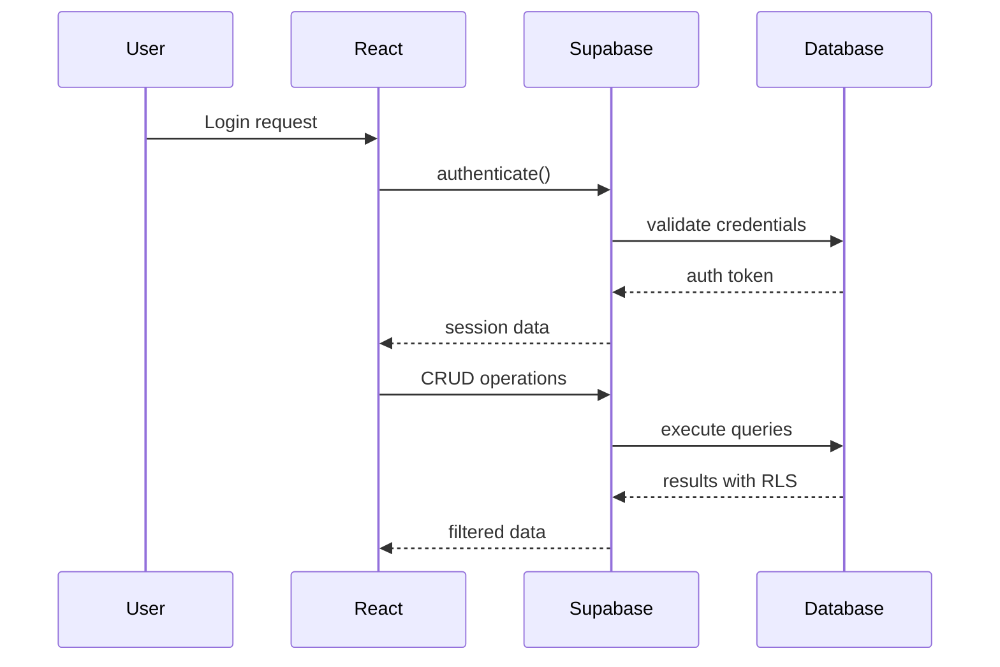
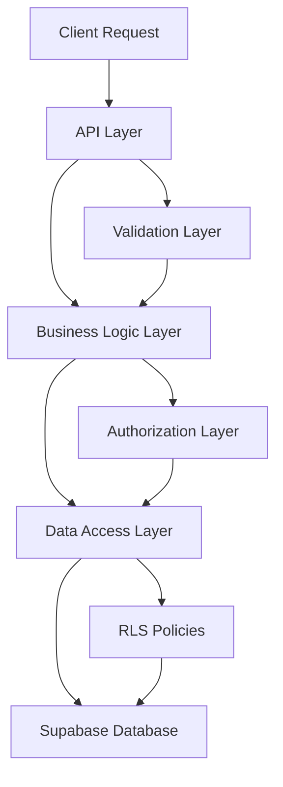
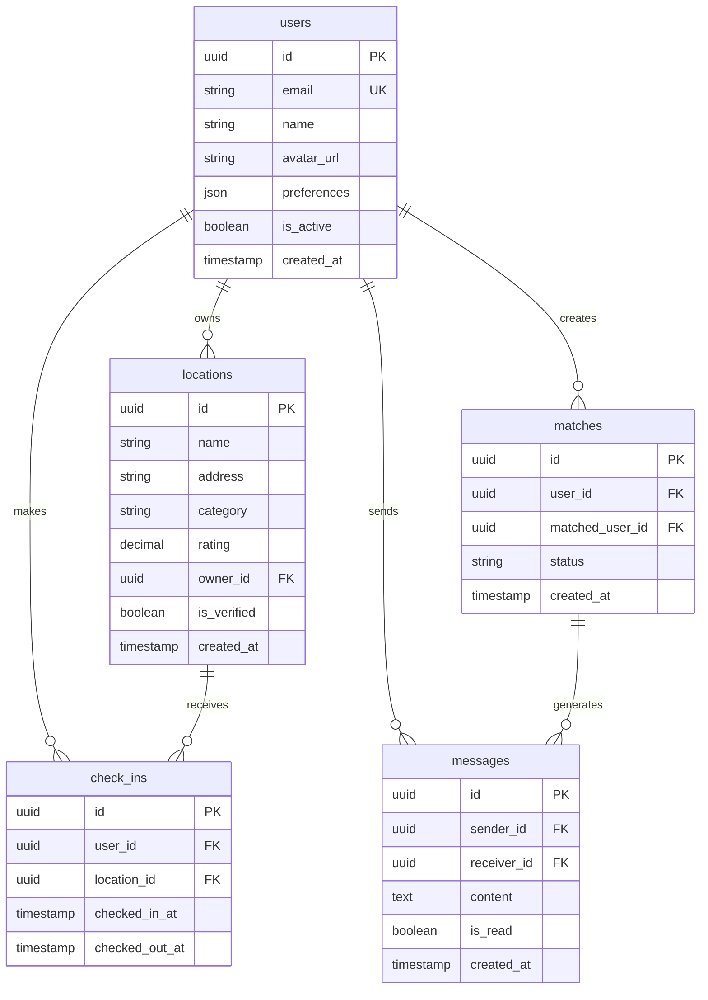

# Arquitetura Técnica - Integração Supabase

## 1. Arquitetura do Sistema

### 1.1 Diagrama de Arquitetura


### 1.2 Fluxo de Dados


## 2. Stack Tecnológica

### 2.1 Frontend
- **Framework**: React 18.2.0
- **Build Tool**: Vite 5.0.0
- **Styling**: Tailwind CSS 3.4.0
- **UI Components**: shadcn/ui
- **TypeScript**: 5.3.0
- **State Management**: React Context + Hooks
- **Router**: React Router DOM 6.20.0

### 2.2 Backend (Supabase)
- **Database**: PostgreSQL 15
- **Authentication**: Supabase Auth
- **Storage**: Supabase Storage
- **Realtime**: Supabase Realtime
- **Edge Functions**: Deno (quando necessário)

### 2.3 Dependências Principais
```json
{
  "dependencies": {
    "@supabase/supabase-js": "^2.38.5",
    "react": "^18.2.0",
    "react-dom": "^18.2.0",
    "react-router-dom": "^6.20.0",
    "tailwindcss": "^3.4.0",
    "@radix-ui/react-dialog": "^1.0.5",
    "@radix-ui/react-toast": "^1.1.5",
    "lucide-react": "^0.294.0"
  },
  "devDependencies": {
    "@types/react": "^18.2.43",
    "@types/react-dom": "^18.2.17",
    "@vitejs/plugin-react": "^4.2.1",
    "typescript": "^5.3.3",
    "vite": "^5.0.8"
  }
}
```

## 3. Estrutura do Projeto

```
src/
├── components/
│   ├── auth/
│   │   ├── LoginForm.tsx
│   │   ├── RegisterForm.tsx
│   │   └── ProtectedRoute.tsx
│   ├── ui/
│   │   ├── button.tsx
│   │   ├── card.tsx
│   │   ├── dialog.tsx
│   │   └── toast.tsx
│   ├── locations/
│   │   ├── LocationCard.tsx
│   │   ├── LocationList.tsx
│   │   └── LocationFilter.tsx
│   └── people/
│       ├── PersonCard.tsx
│       ├── MatchButton.tsx
│       └── PeopleList.tsx
├── pages/
│   ├── Auth.tsx
│   ├── Dashboard.tsx
│   ├── Locations.tsx
│   ├── PeopleMatch.tsx
│   ├── Profile.tsx
│   └── Settings.tsx
├── hooks/
│   ├── useAuth.ts
│   ├── useLocations.ts
│   ├── useMatches.ts
│   └── useRealtime.ts
├── services/
│   ├── auth.service.ts
│   ├── locations.service.ts
│   ├── matches.service.ts
│   └── messages.service.ts
├── integrations/
│   ├── supabase.ts
│   ├── database.types.ts
│   └── storage.ts
├── utils/
│   ├── validators.ts
│   ├── formatters.ts
│   └── audit-logger.ts
├── contexts/
│   ├── AuthContext.tsx
│   ├── LocationContext.tsx
│   └── ThemeContext.tsx
└── types/
    ├── database.ts
    ├── user.ts
    └── location.ts
```

## 4. Definições de API

### 4.1 Tipos TypeScript
```typescript
// src/types/database.ts
export interface Database {
  public: {
    Tables: {
      users: {
        Row: {
          id: string
          email: string
          name: string
          avatar_url: string | null
          bio: string | null
          location: string | null
          preferences: Json | null
          is_active: boolean
          created_at: string
          updated_at: string
        }
        Insert: {
          id?: string
          email: string
          name: string
          avatar_url?: string | null
          bio?: string | null
          location?: string | null
          preferences?: Json | null
          is_active?: boolean
          created_at?: string
          updated_at?: string
        }
        Update: {
          id?: string
          email?: string
          name?: string
          avatar_url?: string | null
          bio?: string | null
          location?: string | null
          preferences?: Json | null
          is_active?: boolean
          created_at?: string
          updated_at?: string
        }
      }
      locations: {
        Row: {
          id: string
          name: string
          address: string
          category: string
          description: string | null
          images: string[] | null
          rating: number
          phone: string | null
          website: string | null
          opening_hours: Json | null
          location: unknown | null
          owner_id: string | null
          is_verified: boolean
          created_at: string
          updated_at: string
        }
        // ... definições Insert e Update
      }
    }
  }
}
```

### 4.2 Serviços de API

#### AuthService
```typescript
// src/services/auth.service.ts
export class AuthService {
  static async signUp(params: {
    email: string
    password: string
    name: string
    avatar?: File
  }) {
    // Implementação do cadastro
  }
  
  static async signIn(email: string, password: string) {
    // Implementação do login
  }
  
  static async signOut() {
    // Implementação do logout
  }
  
  static async updateProfile(userId: string, data: Partial<User>) {
    // Atualização de perfil
  }
}
```

#### LocationService
```typescript
// src/services/locations.service.ts
export class LocationService {
  static async getLocations(params?: {
    category?: string
    search?: string
    limit?: number
    offset?: number
  }) {
    // Busca de locais com filtros
  }
  
  static async getLocationById(id: string) {
    // Busca de local específico
  }
  
  static async createLocation(data: LocationInput) {
    // Criação de novo local
  }
  
  static async updateLocation(id: string, data: Partial<LocationInput>) {
    // Atualização de local
  }
  
  static async deleteLocation(id: string) {
    // Remoção de local
  }
}
```

## 5. Arquitetura do Servidor

### 5.1 Diagrama de Camadas


### 5.2 Edge Functions (Quando Necessário)
```typescript
// supabase/functions/process-payment/index.ts
import { serve } from 'https://deno.land/std@0.168.0/http/server.ts'
import { createClient } from 'https://esm.sh/@supabase/supabase-js@2'

serve(async (req) => {
  const { name, paymentMethod } = await req.json()
  
  // Processamento sensível que não pode ser feito no cliente
  const result = await processPayment(name, paymentMethod)
  
  return new Response(
    JSON.stringify(result),
    { headers: { "Content-Type": "application/json" } }
  )
})
```

## 6. Modelo de Dados

### 6.1 Diagrama ER


### 6.2 Índices de Performance
```sql
-- Índices para performance
CREATE INDEX idx_users_email ON users(email);
CREATE INDEX idx_users_active ON users(is_active);
CREATE INDEX idx_locations_category ON locations(category);
CREATE INDEX idx_locations_rating ON locations(rating DESC);
CREATE INDEX idx_matches_user ON matches(user_id);
CREATE INDEX idx_matches_status ON matches(status);
CREATE INDEX idx_messages_sender ON messages(sender_id);
CREATE INDEX idx_messages_receiver ON messages(receiver_id);
CREATE INDEX idx_checkins_user ON check_ins(user_id);
CREATE INDEX idx_checkins_location ON check_ins(location_id);
CREATE INDEX idx_checkins_active ON check_ins(is_active);

-- Índices geoespaciais
CREATE INDEX idx_locations_geo ON locations USING GIST(location);
```

## 7. Configurações de Segurança

### 7.1 Row Level Security (RLS)
```sql
-- Políticas de segurança para users
CREATE POLICY "users_select_all" ON users
  FOR SELECT USING (is_active = true);

CREATE POLICY "users_update_own" ON users
  FOR UPDATE USING (auth.uid() = id);

CREATE POLICY "users_delete_own" ON users
  FOR DELETE USING (auth.uid() = id);

-- Políticas para locations
CREATE POLICY "locations_select_verified" ON locations
  FOR SELECT USING (is_verified = true OR auth.uid() = owner_id);

CREATE POLICY "locations_insert_authenticated" ON locations
  FOR INSERT WITH CHECK (auth.uid() IS NOT NULL);

CREATE POLICY "locations_update_owner" ON locations
  FOR UPDATE USING (auth.uid() = owner_id);

CREATE POLICY "locations_delete_owner" ON locations
  FOR DELETE USING (auth.uid() = owner_id);
```

### 7.2 Rate Limiting
```typescript
// src/utils/rate-limiter.ts
export class RateLimiter {
  private attempts: Map<string, number[]> = new Map()
  
  constructor(
    private maxAttempts: number,
    private windowMs: number
  ) {}
  
  isAllowed(key: string): boolean {
    const now = Date.now()
    const attempts = this.attempts.get(key) || []
    
    // Limpar tentativas antigas
    const validAttempts = attempts.filter(time => now - time < this.windowMs)
    
    if (validAttempts.length >= this.maxAttempts) {
      return false
    }
    
    validAttempts.push(now)
    this.attempts.set(key, validAttempts)
    return true
  }
}
```

## 8. Performance e Escalabilidade

### 8.1 Otimizações de Query
```typescript
// src/services/optimized.service.ts
export class OptimizedService {
  static async getLocationsWithMetrics() {
    // Usar select específico para reduzir transferência de dados
    const { data, error } = await supabase
      .from('locations')
      .select(`
        id,
        name,
        category,
        rating,
        check_ins(count)
      `)
      .eq('is_verified', true)
      .order('rating', { ascending: false })
      .limit(20)
    
    return { data, error }
  }
  
  static async getUserMatches(userId: string) {
    // Usar joins eficientes
    const { data, error } = await supabase
      .from('matches')
      .select(`
        *,
        matched_user:users!matched_user_id(
          id,
          name,
          avatar_url
        )
      `)
      .eq('user_id', userId)
      .eq('status', 'accepted')
    
    return { data, error }
  }
}
```

### 8.2 Cache Strategy
```typescript
// src/utils/cache.ts
export class CacheManager {
  private cache: Map<string, { data: any; expiry: number }> = new Map()
  
  constructor(private defaultTtl: number = 300000) {} // 5 minutos
  
  async get<T>(key: string, fetcher: () => Promise<T>): Promise<T> {
    const cached = this.cache.get(key)
    
    if (cached && cached.expiry > Date.now()) {
      return cached.data
    }
    
    const data = await fetcher()
    this.set(key, data)
    return data
  }
  
  set(key: string, data: any, ttl: number = this.defaultTtl) {
    this.cache.set(key, {
      data,
      expiry: Date.now() + ttl
    })
  }
  
  invalidate(key: string) {
    this.cache.delete(key)
  }
  
  invalidatePattern(pattern: string) {
    for (const key of this.cache.keys()) {
      if (key.includes(pattern)) {
        this.cache.delete(key)
      }
    }
  }
}
```

## 9. Monitoramento e Observabilidade

### 9.1 Sistema de Logs
```typescript
// src/utils/logger.ts
export enum LogLevel {
  DEBUG = 0,
  INFO = 1,
  WARN = 2,
  ERROR = 3
}

export class Logger {
  constructor(private level: LogLevel = LogLevel.INFO) {}
  
  async log(level: LogLevel, message: string, metadata?: any) {
    if (level < this.level) return
    
    const logEntry = {
      timestamp: new Date().toISOString(),
      level: LogLevel[level],
      message,
      metadata,
      userAgent: navigator.userAgent,
      url: window.location.href
    }
    
    // Enviar para Supabase
    await supabase.from('logs').insert(logEntry)
    
    // Também logar no console em desenvolvimento
    if (import.meta.env.DEV) {
      console.log(`[${LogLevel[level]}] ${message}`, metadata)
    }
  }
  
  debug(message: string, metadata?: any) {
    this.log(LogLevel.DEBUG, message, metadata)
  }
  
  info(message: string, metadata?: any) {
    this.log(LogLevel.INFO, message, metadata)
  }
  
  warn(message: string, metadata?: any) {
    this.log(LogLevel.WARN, message, metadata)
  }
  
  error(message: string, error?: Error, metadata?: any) {
    this.log(LogLevel.ERROR, message, {
      error: error?.message,
      stack: error?.stack,
      ...metadata
    })
  }
}
```

### 9.2 Métricas de Performance
```typescript
// src/utils/metrics.ts
export class MetricsCollector {
  static async trackAPICall(endpoint: string, duration: number, success: boolean) {
    await supabase.from('metrics').insert({
      type: 'api_call',
      endpoint,
      duration,
      success,
      timestamp: new Date().toISOString()
    })
  }
  
  static async trackDatabaseQuery(table: string, operation: string, duration: number) {
    await supabase.from('metrics').insert({
      type: 'db_query',
      table,
      operation,
      duration,
      timestamp: new Date().toISOString()
    })
  }
}
```

## 10. Deployment e CI/CD

### 10.1 Configuração de Ambientes
```typescript
// src/config/environment.ts
export const config = {
  development: {
    supabaseUrl: import.meta.env.VITE_SUPABASE_URL,
    supabaseKey: import.meta.env.VITE_SUPABASE_ANON_KEY,
    enableLogs: true,
    logLevel: LogLevel.DEBUG
  },
  staging: {
    supabaseUrl: import.meta.env.VITE_SUPABASE_URL,
    supabaseKey: import.meta.env.VITE_SUPABASE_ANON_KEY,
    enableLogs: true,
    logLevel: LogLevel.INFO
  },
  production: {
    supabaseUrl: import.meta.env.VITE_SUPABASE_URL,
    supabaseKey: import.meta.env.VITE_SUPABASE_ANON_KEY,
    enableLogs: false,
    logLevel: LogLevel.ERROR
  }
}
```

### 10.2 Checklist de Deploy
- [ ] Variáveis de ambiente configuradas
- [ ] RLS ativado em todas as tabelas
- [ ] Índices de performance criados
- [ ] Testes unitários passando
- [ ] Testes de integração passando
- [ ] Testes de segurança executados
- [ ] Backup do banco configurado
- [ ] Monitoramento ativado
- [ ] Logs de auditoria configurados
- [ ] Rate limiting implementado

## 11. Manutenção e Troubleshooting

### 11.1 Comandos Úteis
```bash
# Verificar conexão com Supabase
npm run test:connection

# Executar migrações
npm run db:migrate

# Gerar tipos TypeScript
npm run db:generate-types

# Fazer backup do banco
npm run db:backup

# Restaurar backup
npm run db:restore
```

### 11.2 Procedimentos de Emergência
1. **Falha de Conexão**: Verificar variáveis de ambiente e status do Supabase
2. **Erro de RLS**: Revisar políticas e permissões do usuário
3. **Performance Degradada**: Verificar índices e otimizar queries
4. **Perda de Dados**: Executar restore do backup mais recente

### 11.3 Contatos e Escalação
- **Desenvolvimento**: Time de engenharia
- **Infraestrutura**: Suporte Supabase
- **Segurança**: Time de segurança
- **Negócios**: Product owner

Esta arquitetura deve ser revisada trimestralmente ou sempre que houver mudanças significativas no sistema.